# Ralph Web Dashboard

A modern web interface for managing Ralph autonomous development loops. Monitor, control, and manage your AI-powered development sessions from the browser.

> **Note**: This document describes the planned architecture for the web dashboard. The current implementation is the bash-based [Ralph for Claude Code](./ralph-claude-code/) CLI tool.

## Overview

Ralph Web Dashboard wraps around the existing Ralph CLI tool, providing a real-time web interface without modifying the core Ralph scripts. The server reads Ralph's state files and log outputs via file polling to provide live updates.

## Architecture

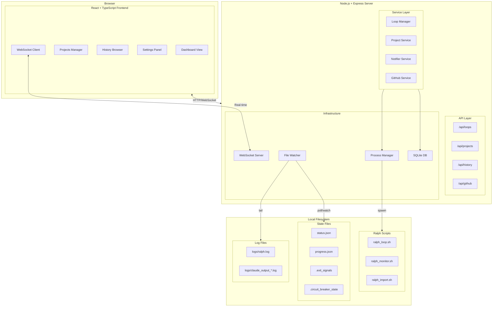

## Ralph Components

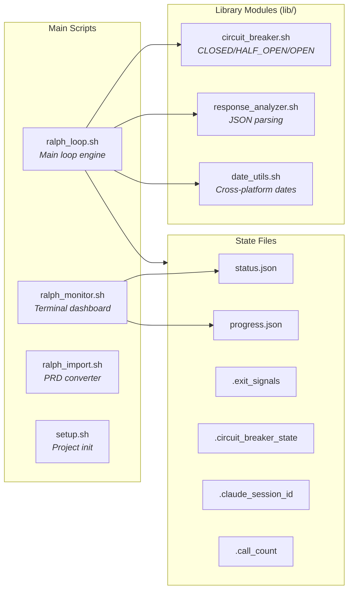

## Data Flow

### Important: File-Based Architecture

Ralph writes all output to files, not stdout. The web server must use **file polling** to capture updates.

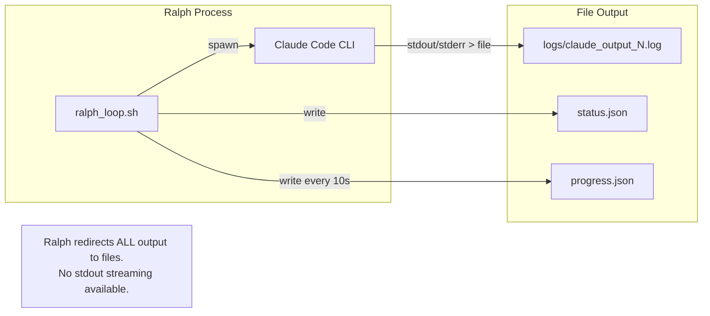

### Starting a Loop

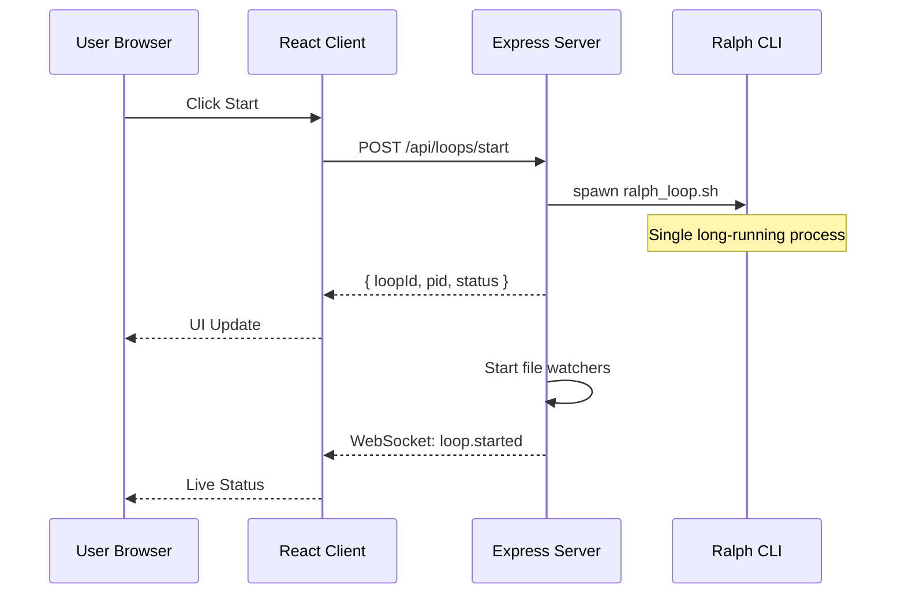

### Real-time Updates via File Polling

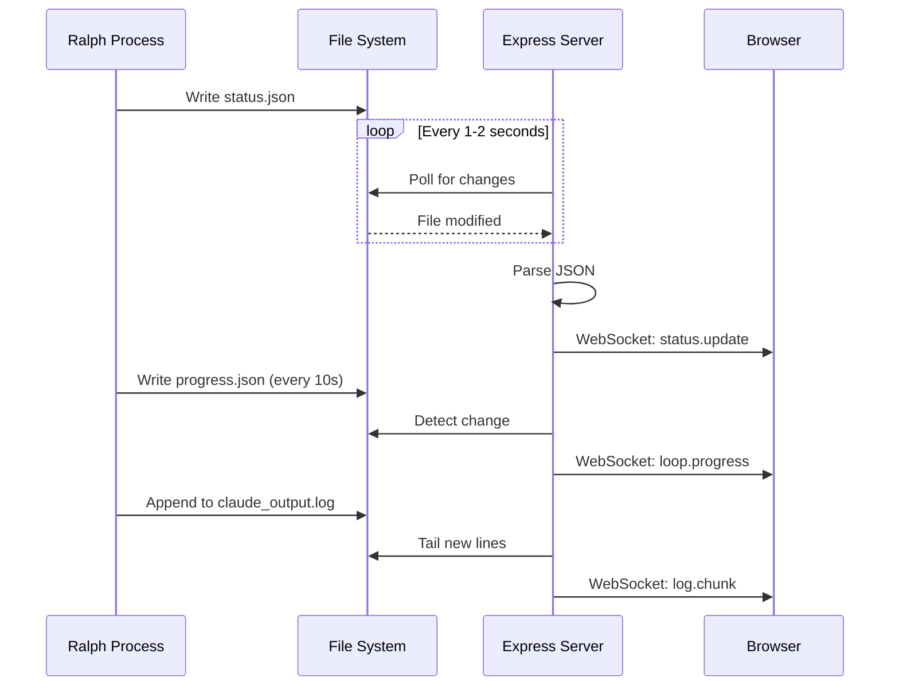

## Component Architecture

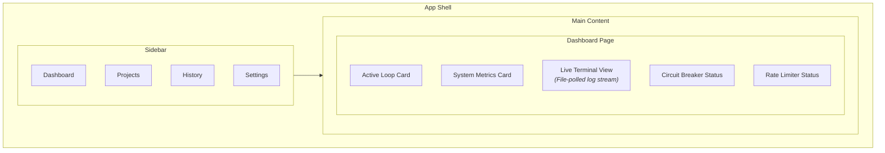

## Backend Services

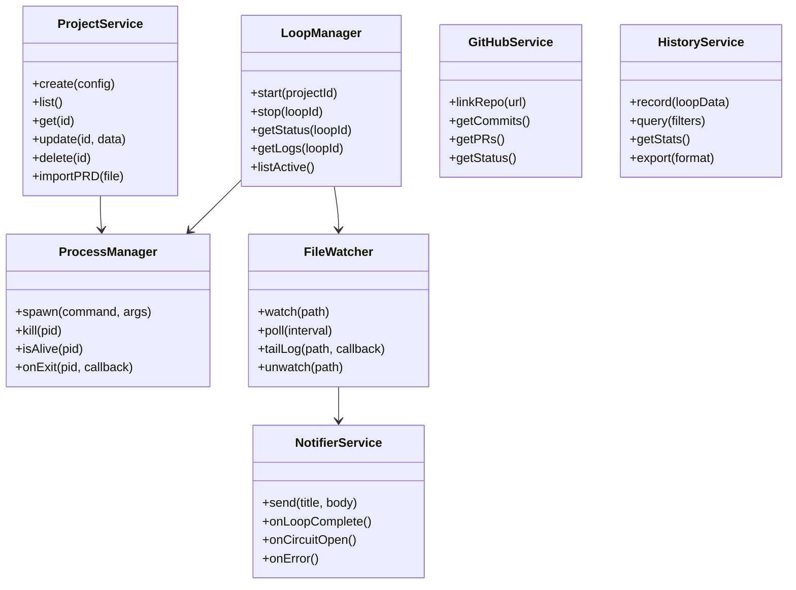

## Database Schema

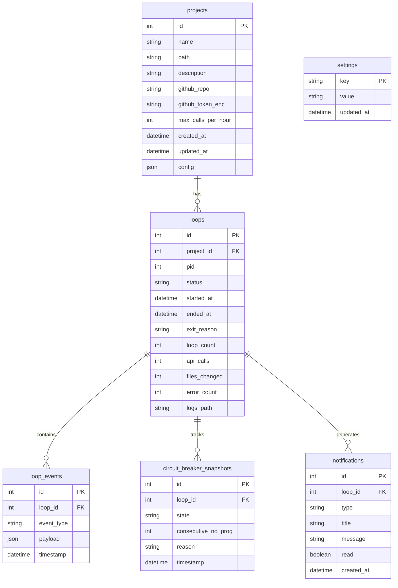

## WebSocket Events

### Server to Client Events

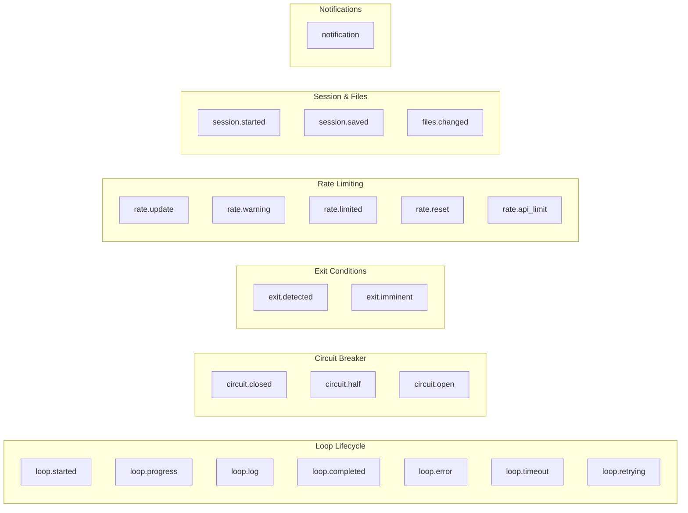

### Event Payloads

| Event | Payload |
|-------|---------|
| `loop.started` | `{ loopId, projectId, pid, timestamp }` |
| `loop.progress` | `{ loopId, iteration, apiCalls, elapsed, status }` |
| `loop.log` | `{ loopId, chunk, timestamp }` |
| `loop.completed` | `{ loopId, exitReason, duration, stats }` |
| `loop.error` | `{ loopId, error, code, recoverable }` |
| `circuit.closed` | `{ loopId, recoveredFrom }` |
| `circuit.half` | `{ loopId, consecutiveNoProgress, monitoring }` |
| `circuit.open` | `{ loopId, reason, loopsSinceProgress }` |
| `exit.detected` | `{ loopId, type, confidence, loopsUntilExit }` |
| `rate.update` | `{ loopId, callsUsed, callsRemaining, resetAt }` |
| `rate.limited` | `{ loopId, minutesUntilReset }` |
| `session.started` | `{ loopId, sessionId, mode: 'new'\|'resume' }` |
| `files.changed` | `{ loopId, count, files: [...] }` |

### Client to Server Events

| Event | Payload | Description |
|-------|---------|-------------|
| `subscribe` | `{ loopId }` | Subscribe to loop updates |
| `unsubscribe` | `{ loopId }` | Unsubscribe from loop |
| `ping` | `{ }` | Keep-alive |

## Ralph State File Formats

### status.json
```json
{
  "timestamp": "2026-01-10T12:34:56Z",
  "loop_count": 5,
  "calls_made_this_hour": 25,
  "max_calls_per_hour": 100,
  "last_action": "executing claude code",
  "status": "running",
  "exit_reason": null,
  "next_reset": "2026-01-10T13:00:00Z"
}
```

### progress.json
```json
{
  "status": "executing",
  "indicator": "⠋",
  "elapsed_seconds": 45,
  "last_output": "Working on feature...",
  "timestamp": "2026-01-10T12:35:41Z"
}
```

### .exit_signals
```json
{
  "test_only_loops": [1, 2],
  "done_signals": [5],
  "completion_indicators": [3, 5]
}
```

### .circuit_breaker_state
```json
{
  "state": "CLOSED",
  "last_change": "2026-01-10T12:00:00Z",
  "consecutive_no_progress": 0,
  "consecutive_same_error": 0,
  "last_progress_loop": 5,
  "total_opens": 1,
  "reason": null,
  "current_loop": 6
}
```

### .claude_session_id
```json
{
  "session_id": "claude-session-abc123",
  "timestamp": 1704902400,
  "expires_at": 1705075200
}
```

## Circuit Breaker State Machine

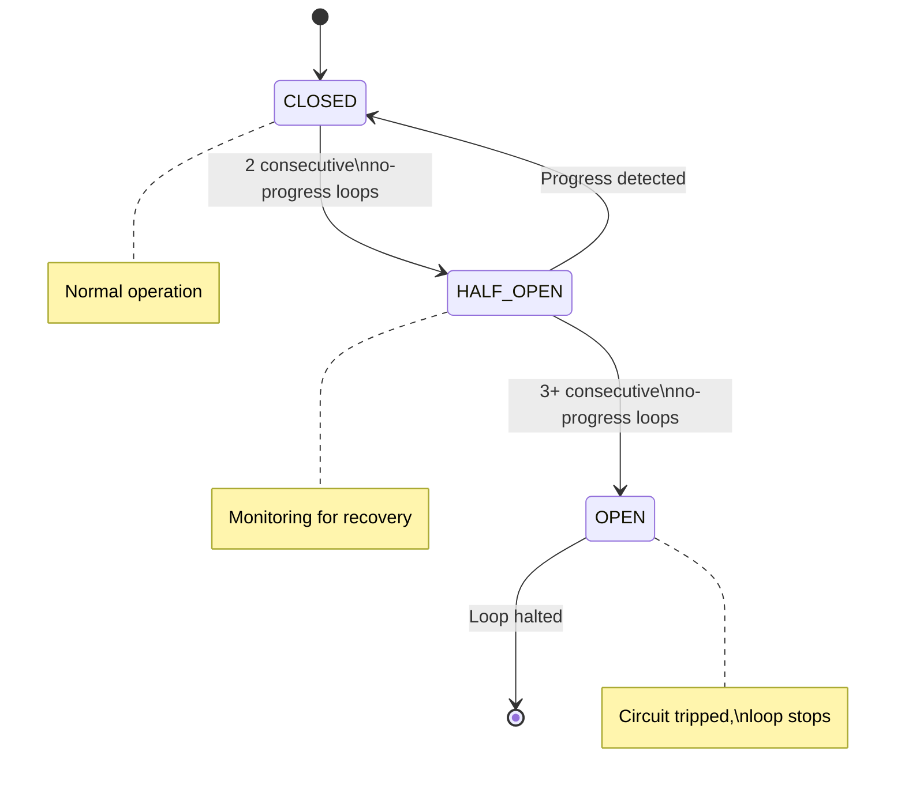

## Security Considerations

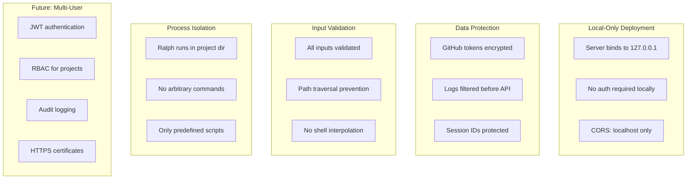

## Tech Stack

| Layer | Technology |
|-------|------------|
| Frontend | React 18, TypeScript, Tailwind CSS |
| State | Zustand |
| Backend | Node.js, Express |
| Real-time | Socket.IO (WebSocket) |
| Database | SQLite (better-sqlite3) |
| File Watching | chokidar |
| Process | Node child_process |
| Notifications | node-notifier |

## Features

### Dashboard
- Real-time loop status and metrics
- Live terminal output with ANSI color support
- Circuit breaker state visualization (CLOSED/HALF_OPEN/OPEN)
- Rate limit countdown timer
- Exit condition detection display

### Project Management
- Create new Ralph projects
- Import PRDs and specifications
- Configure loop settings per project
- Link GitHub repositories

### History
- Browse past loop executions
- Filter by project, status, date
- View detailed loop statistics
- Export history data

### Notifications
- Desktop notifications on loop completion
- Browser notifications (with permission)
- Circuit breaker alerts
- Configurable notification preferences

### GitHub Integration
- Link projects to repositories
- View recent commits
- Monitor PR status
- Quick links to repo

## Getting Started

```bash
# Install dependencies
npm install

# Start development server (runs both client and server)
npm run dev

# Build for production
npm run build

# Start production server
npm start
```

## Project Structure

```
ralph-web/
├── client/                 # React frontend
│   ├── src/
│   │   ├── components/     # UI components
│   │   ├── pages/          # Page components
│   │   ├── hooks/          # Custom React hooks
│   │   │   ├── useWebSocket.ts
│   │   │   ├── useLoopStatus.ts
│   │   │   └── useFilePolling.ts
│   │   ├── services/       # API clients
│   │   ├── store/          # Zustand stores
│   │   └── types/          # TypeScript types
│   └── public/
├── server/                 # Express backend
│   ├── src/
│   │   ├── routes/         # API routes
│   │   ├── services/       # Business logic
│   │   │   ├── LoopManager.ts
│   │   │   ├── FileWatcher.ts
│   │   │   └── ProcessManager.ts
│   │   ├── models/         # Database models
│   │   ├── websocket/      # WebSocket handlers
│   │   └── utils/          # Utilities
│   └── db/                 # SQLite database
├── shared/                 # Shared types
│   └── types/
│       ├── events.ts       # WebSocket event types
│       └── models.ts       # Shared data models
├── ralph-claude-code/      # Ralph CLI (upstream)
└── package.json
```

## Implementation Notes

### File Polling Strategy

Ralph writes to files, not stdout. The server uses this approach:

1. **State Files** (status.json, progress.json, etc.)
   - Poll every 1-2 seconds
   - Compare timestamps to detect changes
   - Parse and broadcast via WebSocket

2. **Log Files** (logs/claude_output_*.log)
   - Track file position (bytes read)
   - Tail new content on each poll
   - Stream chunks to subscribed clients

3. **Performance**
   - Use chokidar for efficient file watching where supported
   - Fall back to polling on unsupported filesystems
   - Debounce rapid file changes

### Process Lifecycle

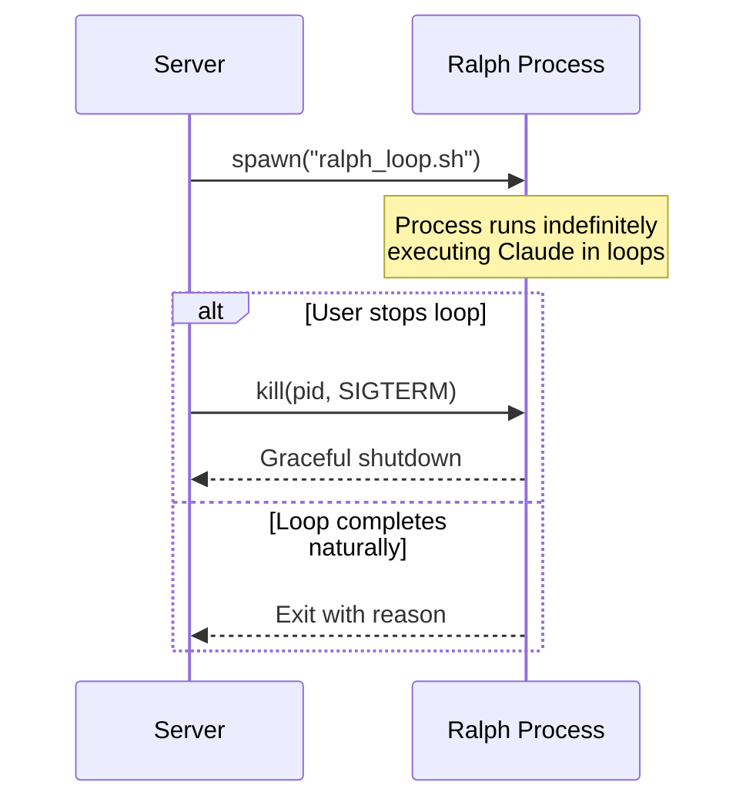

## License

MIT
